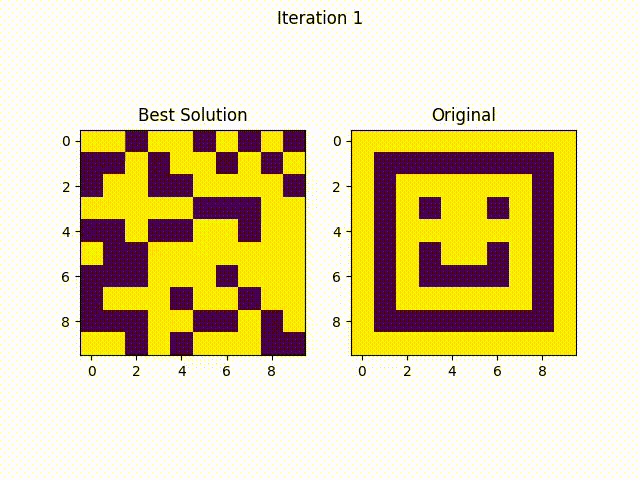

# Evolutionary Image Generator

## Overview
The **Evolutionary Image Generator** is a Python-based application that utilizes **evolutionary computing techniques** to generate images. 

<p align="center">
  
</p>

## Technologies Used
- **Python** - Core programming language.
- **PIL (Pillow)** - Image processing.
- **NumPy** - Efficient numerical computations.
- **Matplotlib** - Visualization of evolutionary progress.
- **Streamlit** - Interactive UI for visualization.
- **Pipenv** - Virtual environment and dependency management.

## Installation & Setup
### Prerequisites
Ensure **Python 3.8+** and **Pipenv** are installed.

### Steps
1. Clone the repository:
   ```sh
   git clone https://github.com/elitecoderx/Evolutionary-Image-Generator.git
   cd Evolutionary-Image-Generator
   ```
2. Install dependencies using Pipenv:
   ```sh
   pipenv install
   ```
3. Activate the virtual environment:
   ```sh
   pipenv shell
   ```

## How It Works
1. **Initialize Population** - Randomly generates an initial set of images.
2. **Evaluate Fitness** - Compares each image against the target image.
3. **Apply Genetic Operators** - Performs crossover and mutation to evolve images.
4. **Iterate** - Continues evolution until the desired resemblance is achieved.

## Future Enhancements
- 🖼 **Improve Fitness Evaluation** using deep learning.
- ⚡ **Optimize Evolutionary Operators** for faster convergence.
- 🌐 **Deploy as a Web App** using Streamlit.

## Contributing
Contributions are welcome! Fork the repository, make changes, and submit a PR.

## License
This project is licensed under the MIT License.

